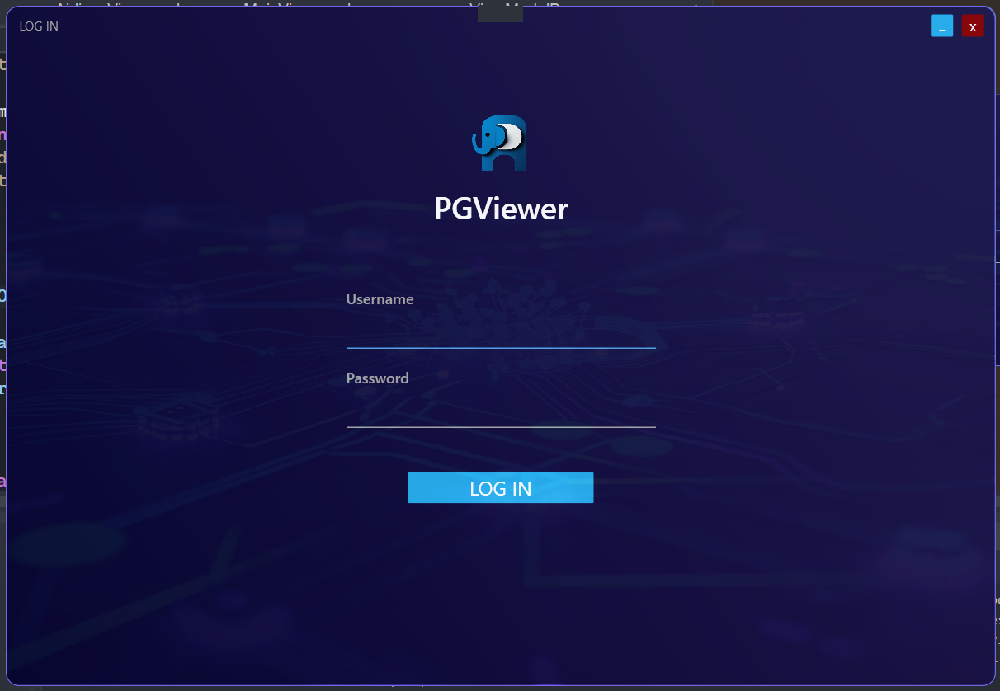
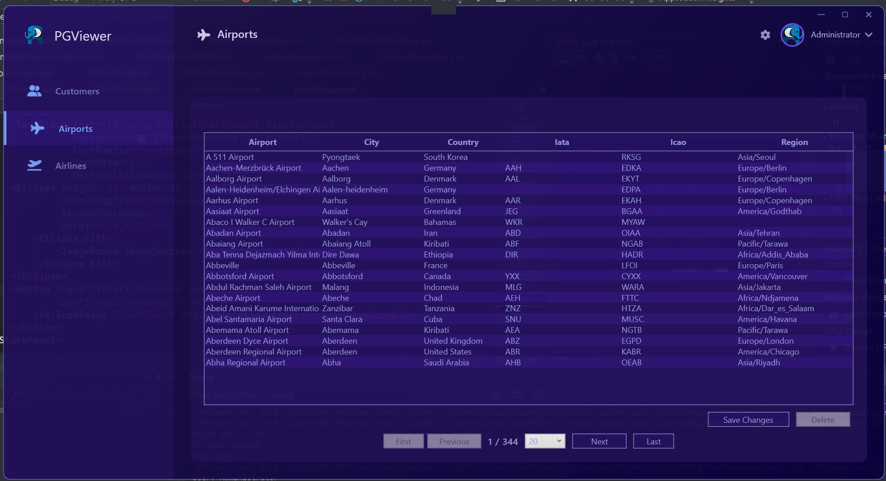

# ADO.NET basics

The application demonstrates the following features:
* Connection to the database with the selected user and password
* Reading and displaying on the screen the contents of one or more database tables
* Changing data in tables
* Adding new and/or deleting data to database tables

Non-functional requirements:
* ADO.NET
* Windows Presentation Foundation
* MVVM pattern
* Using PostgreSQL

## How to run

Run postgresql:
~~~
cd db && docker-compose up -d
~~~

Then in the login window you will need to enter **admin** name and password **12345678**

## Application screenshots

### Login

### Airports window

